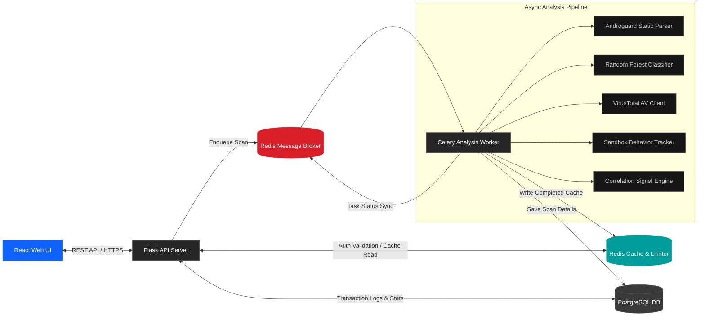
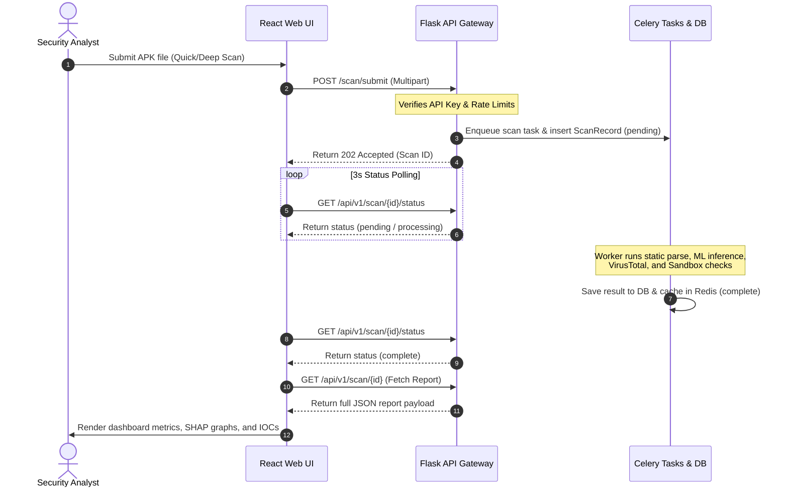

# ASTRA — Advanced System for Threat Recognition & Analysis

ASTRA is an enterprise-grade security intelligence and threat analysis platform designed to detect, classify, and correlate malicious signatures inside Android Application Packages (APKs). Using static analysis, machine learning classifiers, VirusTotal AV intelligence, sandboxed dynamic behavior tracking, and cryptographic signature matching, ASTRA acts as a security operations center (SOC) cockpit for mobile endpoint threats.

The user interface follows strict QRadar, Splunk, and Grafana enterprise dark-theme design rules for telemetry dashboards.

---

## 🏛️ System Architecture

The following diagram illustrates the decoupled, multi-container workflow structure of the ASTRA platform:



---

## ⚡ Core Analysis Pipeline Flow

Here is the sequence of events triggered when an analyst submits an APK for deep threat inspection:



---

## 📁 Repository Directory Structure

```directory
ASTRA/
├── backend/
│   ├── app/
│   │   ├── analysis/
│   │   │   ├── __init__.py
│   │   │   ├── androguard_extractor.py  # Static manifest & file parser
│   │   │   ├── cert_lookup.py           # Trusted certificate database lookup
│   │   │   ├── correlation.py           # Weight metrics & confidence engine
│   │   │   ├── ml_engine.py             # Random Forest model loader
│   │   │   └── vt_client.py             # VirusTotal AV & sandbox interface
│   │   ├── api/
│   │   │   ├── __init__.py
│   │   │   ├── auth.py                  # API key generation & Redis validation
│   │   │   └── routes.py                # REST endpoint controllers
│   │   ├── models/
│   │   │   ├── __init__.py
│   │   │   └── scan.py                  # ScanRecord & CertificateRecord SQLAlchemy schemas
│   │   ├── tasks/
│   │   │   ├── __init__.py
│   │   │   └── scan_tasks.py            # Celery task coordination
│   │   ├── __init__.py                  # Flask Application Factory
│   │   ├── config.py                    # Environment parser (Dev, Testing, Prod)
│   │   └── extensions.py                # Database, Celery, and Limiter singletons
│   ├── ml/
│   │   ├── dynamic_features.csv         # ML training feature dataset
│   │   ├── random_forest_model.joblib   # Trained classifier model binary
│   │   ├── scaler.joblib                # Fitted feature scaler binary
│   │   ├── train_model.py               # Standalone training & metrics evaluator
│   │   └── trusted_certs.json           # Trusted signature lookup db
│   ├── celery_worker.py                 # Celery entrypoint daemon
│   ├── Dockerfile                       # Python Debian backend container definition
│   ├── requirements.txt                 # Backend dependency listing
│   └── run.py                           # Flask WSGI dev entrypoint
├── frontend/
│   ├── public/
│   │   └── icons.svg                    # SVG icons vector map
│   ├── src/
│   │   ├── api/
│   │   │   └── client.js                # Axios client + REST calls
│   │   ├── components/
│   │   │   ├── Header.jsx               # Simple page title bar
│   │   │   ├── Layout.jsx               # Navigation & content wrapper
│   │   │   ├── RiskScore.jsx            # Monospace score meter
│   │   │   ├── Sidebar.jsx              # QRadar navigation vertical bar
│   │   │   ├── StatCard.jsx             # Flat counter cards
│   │   │   └── VerdictBadge.jsx         # Severity verdict badge tags
│   │   ├── pages/
│   │   │   ├── Campaigns.jsx            # Certificate campaign pivots tracker
│   │   │   ├── Dashboard.jsx            # Platform stats & recent scan logs
│   │   │   ├── IOCFeed.jsx              # STIX 2.1 indicator exporter
│   │   │   ├── ScanResult.jsx           # SHAP graphs, MITRE logs, reports
│   │   │   └── ScanSubmit.jsx           # APK upload dropzone & status polling
│   │   ├── App.jsx                      # Router mapping
│   │   ├── index.css                    # Design token variables & resets
│   │   └── main.jsx                     # Strict DOM entry wrapper
│   ├── package.json                     # Frontend scripts & dependencies
│   ├── tailwind.config.js               # Theme extenders configuration
│   └── vite.config.js                   # Dev server configs
├── uploads/                             # Temp folder for APK uploads
├── docker-compose.yml                   # Container orchestration spec
├── .env.example                         # Environment config templates
└── README.md                            # You are here
```

---

## 🛠️ Installation & Setup

### Option A: Containerized Deployment (Recommended)

ASTRA runs inside a multi-container Docker environment. 

> [!CAUTION]
> Hardware virtualization (Intel VT-x or AMD-V) must be enabled in your system's BIOS settings for Docker containers to spin up the WSL2 subsystem correctly.

1. Clone the repository and configure your environment:
   ```bash
   cp .env.example .env
   ```
2. Build and stand up all services (Gunicorn Backend, Celery Worker, PostgreSQL, Redis Broker):
   ```bash
   docker compose up --build -d
   ```
3. Initialize and run database migrations:
   ```bash
   docker compose exec backend flask db migrate -m "initialize schema"
   docker compose exec backend flask db upgrade
   ```
4. Access the web interface at `http://localhost:5173` (Vite dev server) or direct production builds.

---

### Option B: Local Standalone Execution (Windows/Local)

To run the application directly on your host environment:

#### 1. Backend Server Setup
- Python 3.11 is required.
- Install local system package requirements (specifically `libmagic1` or `python-magic-bin` for MIME type checks on Windows).
- Set up a virtual environment and install dependencies:
  ```bash
  cd backend
  pip install -r requirements.txt
  ```
- Configure local databases (change hostnames from `db` and `redis` to `localhost` inside `.env`).
- Run the Flask development server:
  ```bash
  python run.py
  ```
- Run the Celery task queue worker daemon:
  ```bash
  celery -A celery_worker.celery_app worker --loglevel=info -P solo
  ```
  Note: -P solo flag is required on Windows hosts.
  Linux/Mac users can omit this flag.

#### 2. Frontend client Setup
- Node.js (v18+) is required.
- Install dependencies and start the development hot-reloader:
  ```bash
  cd frontend
  npm install
  npm run dev
  ```
- Access the web interface at `http://localhost:5173`.

---

## 📊 REST API Specification

All API paths are prefixed under `/api/v1`. Authentication requires the header `X-API-Key: <key>`. A master developer bypass key `dev-master-key` is configured for local validation.

| Verb | Path | Auth Required | Description |
|---|---|---|---|
| **GET** | `/health` | No | System status ping (checks Postgres & Redis connections) |
| **POST** | `/auth/generate` | No | Generates and persists a secure API key to Redis |
| **POST** | `/scan/submit` | Yes | Uploads APK file payload and enqueues async analysis |
| **GET** | `/scan/<id>/status` | Yes | Retrieves current analysis job status (`pending`, `processing`, `complete`, `failed`) |
| **GET** | `/scan/<id>` | Yes | Returns complete structured metrics, SHAP top features, and reports |
| **GET** | `/certificate/<hash>/pivot` | Yes | Fetches all APK records compiled using the target certificate |
| **GET** | `/feed/iocs` | Yes | Returns threat intelligence data structured as a STIX 2.1 bundle |
| **GET** | `/stats` | Yes | Computes platform metrics (Total, Malicious, Clean, tracked certs) |

---

## 🎨 Enterprise Design Token Guidelines

Our UI matches IBM QRadar and Splunk telemetry style sheets. There is **zero tolerance** for floating shapes, neon borders, rounded pills, shadows, gradients, or non-security graphics.

<details>
<summary><b>📐 CSS Layout Constraints</b></summary>

```css
:root {
  --bg-primary: #161616;       /* Standard application background */
  --bg-secondary: #262626;     /* Card panels & Sidebar panels */
  --bg-elevated: #393939;      /* Inputs on focus, active navs, table th */
  --border: #525252;           /* Primary panels outline */
  --border-subtle: #393939;    /* Table rows separators */
  --text-primary: #f4f4f4;     /* Headers & primary text */
  --text-secondary: #c6c6c6;   /* Labels, tags, details */
  --text-placeholder: #8d8d8d; /* Muted alerts */
  
  --action-blue: #0f62fe;      /* Primary button & links */
  --success: #24a148;          /* Clean verdicts */
  --warning: #f1c21b;          /* Suspicious flags */
  --danger: #da1e28;           /* Malicious detections */
  --info: #009d9a;             /* Low risk indicators */
}

* {
  border-radius: 0px !important; /* Zero rounded corners */
  box-shadow: none !important;    /* Zero drop shadows */
}
```
</details>

---

## 📈 ML Inference Model

The ASTRA classifier is a stratified Random Forest Ensemble trained on the CICMalDroid 2020 dataset from the University of New Brunswick.

Dataset details:
- Source: CICMalDroid 2020 (University of New Brunswick)
- Training samples: 11,598 APKs
- Feature type: 470 dynamic syscall and binder call FREQUENCY features captured during live APK runtime execution — NOT static manifest features
- Classes: 5 malware categories

Model performance:
- Overall Test Accuracy: 94.27%
- Explainability: SHAP TreeExplainer with top-10 feature attribution per prediction showing which syscalls drove the classification decision

| Class | Precision | Recall | F1-Score | Support |
|---|---|---|---|---|
| Adware | 0.8429 | 0.9402 | 0.8889 | 251 |
| Banking Malware | 0.9692 | 0.9000 | 0.9333 | 420 |
| SMS Malware | 0.9760 | 0.9885 | 0.9822 | 781 |
| Riskware | 0.9585 | 0.9077 | 0.9324 | 509 |
| Benign | 0.8992 | 0.9443 | 0.9212 | 359 |
| **Weighted Avg** | **0.9446** | **0.9427** | **0.9429** | **2320** |

---

## 🔬 5-Signal Correlation Engine

ASTRA combines five independent signals into a single weighted risk score (0-100). No single signal determines the verdict — all five must be correlated.

| Signal | Weight | Data Source |
|---|---|---|
| ML Classification | 35% | Random Forest on 470 dynamic syscall features |
| VirusTotal AV Consensus | 30% | 72+ AV engine detection ratio |
| Sandbox Behavior | 20% | VT R2DBox + Zenbox runtime analysis |
| Certificate Signature | 15% | 34-cert verified Indian banking app DB |

Risk score thresholds:
- MALICIOUS: score >= 70
- SUSPICIOUS: score >= 40
- LOW RISK: score >= 20
- CLEAN: score < 20

Confidence levels are determined by signal agreement:
- HIGH: 4/4 signals agree
- MEDIUM: 3/4 signals agree
- LOW: 2/4 signals agree
- INSUFFICIENT DATA: 0-1 signals agree

---

## 🏦 Trusted Certificate Database

ASTRA ships with 34 verified certificate SHA-256 hashes extracted directly from official Indian banking APKs. When an uploaded APK's signing certificate matches this database, it receives a TRUSTED signature verdict, reducing false positive risk for legitimate banking apps.

<details>
<summary><b>View all 34 verified banking applications</b></summary>

| App Name | Source File |
|---|---|
| Axis Mobile | AXIS_BANK.json |
| bob World | bob World.json |
| BOI Mobile | BOI Mobile.json |
| Canara ai1 | Canara ai1.json |
| Cent Mobile | Cent Mobile.json |
| CentPay | CentPay.json |
| CSBMobile+ Smart Banking | CSB_MOBILE_BANK.json |
| CUB mBank Plus | CUB_BANK.json |
| DCB Bank | DCB_BANK.json |
| DhanSmart-5x | DHAN_SMART_BANK.json |
| FedMobile | FEDERAL_BANK.json |
| HDFC Bank | HDFC_BANK.json |
| iMobile (ICICI) | ICICI_BANK.json |
| IDBI Bank | IDBI_BANK.json |
| IndSMART | indSMART.json |
| INDIE (IndusInd) | INDUSLAND_BANK.json |
| IOB Mobile | IOB Mobile.json |
| JKB mPay Delight+ | JKB_mPAY_BANK.json |
| KBL Mobile Plus | KBL_BANK.json |
| Kotak811 | KOTAK811_BANK.json |
| Kotak Bank | KOTAK_BANK.json |
| KVB DLite | KVB_DLITE_BANK.json |
| Mahamobile Plus | Mahamobile Plus.json |
| mBandhan (v1) | mBandhan.json |
| mBandhan (v2) | mBANDHAN_BANK.json |
| NAINI NEO | NAINI_NEO_BANK.json |
| PNB ONE | PNB ONE.json |
| PSB UnIC | PSB UnIC.json |
| RBL BizBank | RBL_BIZ_BANK.json |
| RBL MyBank | RBL_MY_BANK.json |
| SIB Mirror+ | SIB_BANK.json |
| UCO mBanking Plus | UCO mBanking Plus.json |
| Vyom (Union Bank) | Vyom.json |
| IRIS by YES BANK | YES_BANK.json |

</details>

---

## ⚠️ Known Limitations

- **ML training data age**: CICMalDroid 2020 contains APK behavior data from 2017-2018. Real-world accuracy on post-2022 malware families may be lower. VirusTotal sandbox integration partially compensates for this by providing live behavioral analysis.

- **VirusTotal free tier rate limits**: 4 requests per minute and 500 requests per day. Deep scans take 60-90 seconds due to mandatory rate limit delays. Premium VT API removes this constraint.

- **Certificate database maintenance**: Certificate hashes were extracted from APK versions available at build time. As banking apps release updates with new signing certificates, the trusted_certs.json requires manual re-extraction to stay current.

- **SQLite vs PostgreSQL**: SQLite is used in local standalone mode for convenience. For production deployments with concurrent scan loads, PostgreSQL is strongly recommended.

- **Windows Celery limitation**: Celery requires the -P solo pool flag on Windows due to missing Unix process forking support. This limits concurrent task processing to one job at a time.

- **Static feature proxy for ML**: The ML model was trained on dynamic runtime features (syscall frequencies). At inference time, ASTRA maps static Androguard features to this feature space as a best-effort proxy. Confidence scores reflect this approximation.
