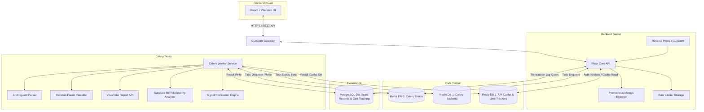
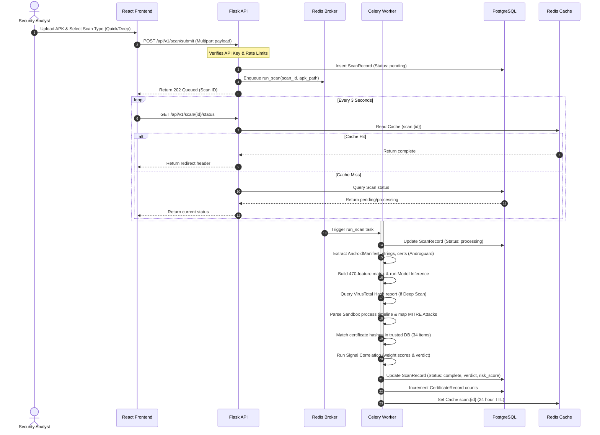

# ASTRA — Advanced System for Threat Response & Analysis

ASTRA is an enterprise-grade security intelligence and threat analysis platform designed to detect, classify, and correlate malicious signatures inside Android Application Packages (APKs). Using static analysis, machine learning classifiers, VirusTotal AV intelligence, sandboxed dynamic behavior tracking, and cryptographic signature matching, ASTRA acts as a security operations center (SOC) cockpit for mobile endpoint threats.

The user interface follows strict QRadar, Splunk, and Grafana enterprise dark-theme design rules for telemetry dashboards.

---

## 🏛️ System Architecture

The following diagram illustrates the decoupled, multi-container workflow structure of the ASTRA platform:



---

## ⚡ Core Analysis Pipeline Flow

Here is the sequence of events triggered when an analyst submits an APK for deep threat inspection:



---

## 📁 Repository Directory Structure

```directory
ASTRA/
├── backend/
│   ├── app/
│   │   ├── analysis/
│   │   │   ├── __init__.py
│   │   │   ├── androguard_extractor.py  # Static manifest & file parser
│   │   │   ├── cert_lookup.py           # Trusted certificate database lookup
│   │   │   ├── correlation.py           # Weight metrics & confidence engine
│   │   │   ├── ml_engine.py             # Random Forest model loader
│   │   │   └── vt_client.py             # VirusTotal AV & sandbox interface
│   │   ├── api/
│   │   │   ├── __init__.py
│   │   │   ├── auth.py                  # API key generation & Redis validation
│   │   │   └── routes.py                # REST endpoint controllers
│   │   ├── models/
│   │   │   ├── __init__.py
│   │   │   └── scan.py                  # ScanRecord & CertificateRecord SQLAlchemy schemas
│   │   ├── tasks/
│   │   │   ├── __init__.py
│   │   │   └── scan_tasks.py            # Celery task coordination
│   │   ├── __init__.py                  # Flask Application Factory
│   │   ├── config.py                    # Environment parser (Dev, Testing, Prod)
│   │   └── extensions.py                # Database, Celery, and Limiter singletons
│   ├── ml/
│   │   ├── dynamic_features.csv         # ML training feature dataset
│   │   ├── random_forest_model.joblib   # Trained classifier model binary
│   │   ├── scaler.joblib                # Fitted feature scaler binary
│   │   ├── train_model.py               # Standalone training & metrics evaluator
│   │   └── trusted_certs.json           # Trusted signature lookup db
│   ├── celery_worker.py                 # Celery entrypoint daemon
│   ├── Dockerfile                       # Python Debian backend container definition
│   ├── requirements.txt                 # Backend dependency listing
│   └── run.py                           # Flask WSGI dev entrypoint
├── frontend/
│   ├── public/
│   │   └── icons.svg                    # SVG icons vector map
│   ├── src/
│   │   ├── api/
│   │   │   └── client.js                # Axios client + REST calls
│   │   ├── components/
│   │   │   ├── Header.jsx               # Simple page title bar
│   │   │   ├── Layout.jsx               # Navigation & content wrapper
│   │   │   ├── RiskScore.jsx            # Monospace score meter
│   │   │   ├── Sidebar.jsx              # QRadar navigation vertical bar
│   │   │   ├── StatCard.jsx             # Flat counter cards
│   │   │   └── VerdictBadge.jsx         # Severity verdict badge tags
│   │   ├── pages/
│   │   │   ├── Campaigns.jsx            # Certificate campaign pivots tracker
│   │   │   ├── Dashboard.jsx            # Platform stats & recent scan logs
│   │   │   ├── IOCFeed.jsx              # STIX 2.1 indicator exporter
│   │   │   ├── ScanResult.jsx           # SHAP graphs, MITRE logs, reports
│   │   │   └── ScanSubmit.jsx           # APK upload dropzone & status polling
│   │   ├── App.jsx                      # Router mapping
│   │   ├── index.css                    # Design token variables & resets
│   │   └── main.jsx                     # Strict DOM entry wrapper
│   ├── package.json                     # Frontend scripts & dependancies
│   ├── tailwind.config.js               # Theme extenders configuration
│   └── vite.config.js                   # Dev server configs
├── uploads/                             # Temp folder for APK uploads
├── docker-compose.yml                   # Container orchestration spec
├── .env.example                         # Environment config templates
└── README.md                            # You are here
```

---

## 🛠️ Installation & Setup

### Option A: Containerized Deployment (Recommended)

ASTRA runs inside a multi-container Docker environment. 

> [!CAUTION]
> Hardware virtualization (Intel VT-x or AMD-V) must be enabled in your system's BIOS settings for Docker containers to spin up the WSL2 subsystem correctly.

1. Clone the repository and configure your environment:
   ```bash
   cp .env.example .env
   ```
2. Build and stand up all services (Gunicorn Backend, Celery Worker, PostgreSQL, Redis Broker):
   ```bash
   docker compose up --build -d
   ```
3. Initialize and run database migrations:
   ```bash
   docker compose exec backend flask db migrate -m "initialize schema"
   docker compose exec backend flask db upgrade
   ```
4. Access the web interface at `http://localhost:5173` (Vite dev server) or direct production builds.

---

### Option B: Local Standalone Execution (Windows/Local)

To run the application directly on your host environment:

#### 1. Backend Server Setup
- Python 3.11 is required.
- Install local system package requirements (specifically `libmagic1` or `python-magic-bin` for MIME type checks on Windows).
- Set up a virtual environment and install dependencies:
  ```bash
  cd backend
  pip install -r requirements.txt
  ```
- Configure local databases (change hostnames from `db` and `redis` to `localhost` inside `.env`).
- Run the Flask development server:
  ```bash
  python run.py
  ```
- Run the Celery task queue worker daemon:
  ```bash
  celery -A celery_worker.celery worker --loglevel=info
  ```

#### 2. Frontend client Setup
- Node.js (v18+) is required.
- Install dependencies and start the development hot-reloader:
  ```bash
  cd frontend
  npm install
  npm run dev
  ```
- Access the web interface at `http://localhost:5173`.

---

## 📊 REST API Specification

All API paths are prefixed under `/api/v1`. Authentication requires the header `X-API-Key: <key>`. A master developer bypass key `dev-master-key` is configured for local validation.

| Verb | Path | Auth Required | Description |
|---|---|---|---|
| **GET** | `/health` | No | System status ping (checks Postgres & Redis connections) |
| **POST** | `/auth/generate` | No | Generates and persists a secure API key to Redis |
| **POST** | `/scan/submit` | Yes | Uploads APK file payload and enqueues async analysis |
| **GET** | `/scan/<id>/status` | Yes | Retrieves current analysis job status (`pending`, `processing`, `complete`, `failed`) |
| **GET** | `/scan/<id>` | Yes | Returns complete structured metrics, SHAP top features, and reports |
| **GET** | `/certificate/<hash>/pivot` | Yes | Fetches all APK records compiled using the target certificate |
| **GET** | `/feed/iocs` | Yes | Returns threat intelligence data structured as a STIX 2.1 bundle |
| **GET** | `/stats` | Yes | Computes platform metrics (Total, Malicious, Clean, tracked certs) |

---

## 🎨 Enterprise Design Token Guidelines

Our UI matches IBM QRadar and Splunk telemetry style sheets. There is **zero tolerance** for floating shapes, neon borders, rounded pills, shadows, gradients, or non-security graphics.

<details>
<summary><b>📐 CSS Layout Constraints</b></summary>

```css
:root {
  --bg-primary: #161616;       /* Standard application background */
  --bg-secondary: #262626;     /* Card panels & Sidebar panels */
  --bg-elevated: #393939;      /* Inputs on focus, active navs, table th */
  --border: #525252;           /* Primary panels outline */
  --border-subtle: #393939;    /* Table rows separators */
  --text-primary: #f4f4f4;     /* Headers & primary text */
  --text-secondary: #c6c6c6;   /* Labels, tags, details */
  --text-placeholder: #8d8d8d; /* Muted alerts */
  
  --action-blue: #0f62fe;      /* Primary button & links */
  --success: #24a148;          /* Clean verdicts */
  --warning: #f1c21b;          /* Suspicious flags */
  --danger: #da1e28;           /* Malicious detections */
  --info: #009d9a;             /* Low risk indicators */
}

* {
  border-radius: 0px !important; /* Zero rounded corners */
  box-shadow: none !important;    /* Zero drop shadows */
}
```
</details>

---

## 📈 ML Inference Model

The ASTRA classifier consists of a stratified **Random Forest Ensemble** trained against `backend/ml/dynamic_features.csv` (containing 470 binary features extracted from permissions, intents, network calls, and manifest API declarations). 

*   **Accuracy:** `94.27%` on standard stratified testing splits.
*   **Explainability:** Integrated **SHAP (SHapley Additive exPlanations)** values calculation detailing why features increase or decrease the risk profile during prediction.
